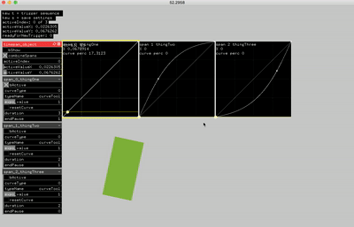

# ofxTimeSpan

ofxTimeSpan provides functions to help schedule and trigger actions.

* set the duration during which a curve gets traversed
* set a pause before the next span starts
* a bool flag notifies you when span just began

### DEPENDENCIES: 
[ofxCurvesTool](https://github.com/antimodular/ofxCurvesTool)
[ofxTiming](https://github.com/kylemcdonald/ofxTiming)
ofxGui

